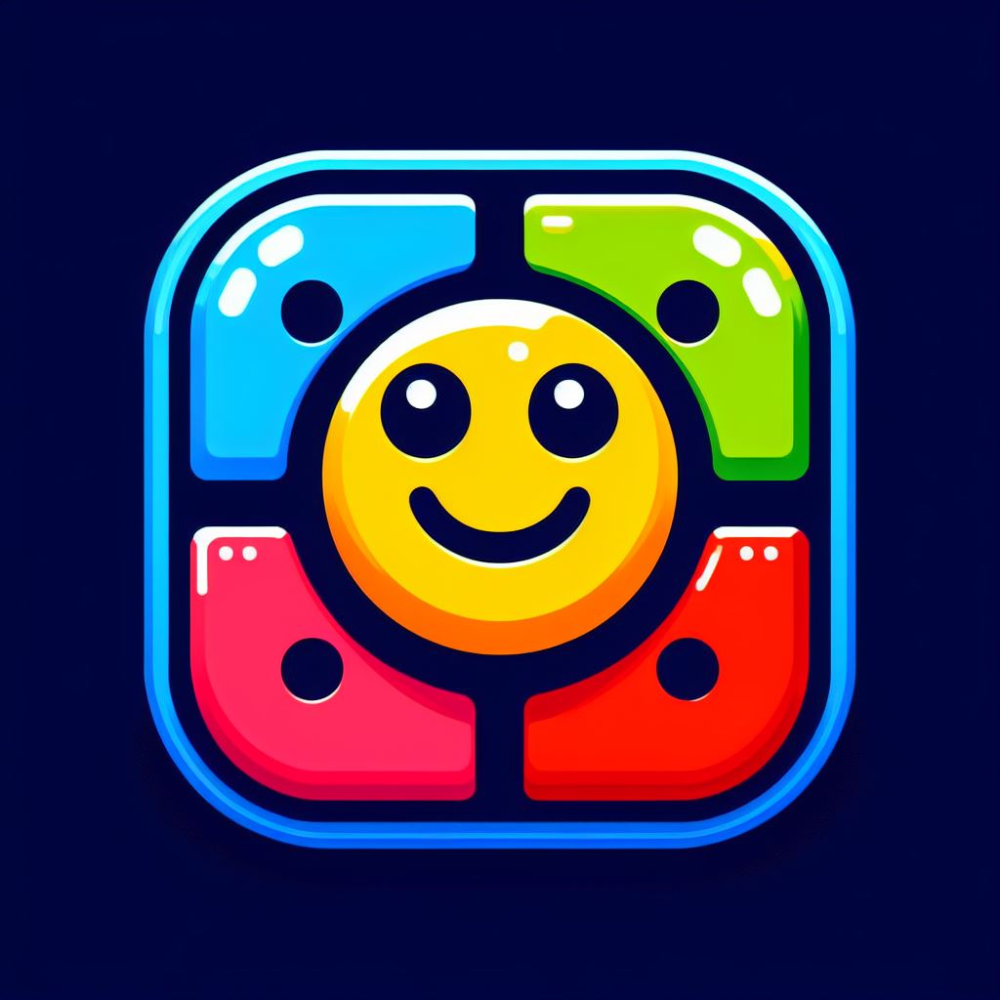

# 🎉 Welcome to the Simon Game! 🎉



Welcome to the amazing and colorful world of the **Simon Game**! 🌈✨ Get ready to challenge your memory and have tons of fun along the way. This classic game will keep you on your toes as you try to follow the sequence of colors and sounds. Can you beat your high score? Let's find out! 🚀

## 🌟 How to Play

1. **Press Any Key to Start** 🕹️
   - Simply press any key on your keyboard to begin the game. The game will generate a sequence of colors for you to follow.

2. **Watch the Sequence** 👀
   - Pay close attention as the game shows you a sequence of flashing colors. Try to remember the order!

3. **Repeat the Sequence** 🧠
   - Click on the colored buttons to repeat the sequence in the correct order. Each round adds a new color to the sequence, making it more challenging.

4. **Level Up!** 🚀
   - With each correct sequence, you'll level up and the game will become more difficult. How far can you go?

5. **Game Over** 💀
   - If you make a mistake, it's game over! But don't worry, you can always restart and try again.

## 🎮 Controls

- **Keyboard**: Press any key to start the game.
- **Mouse**: Click on the colored buttons to repeat the sequence.

## 🎨 Color Buttons

- 🔴 **Red**
- 🟡 **Yellow**
- 🟢 **Green**
- 🟣 **Purple**

## 🔧 Project Structure

- **index.html**: The main HTML file containing the structure of the game.
- **style.css**: The CSS file for styling the game.
- **app.js**: The JavaScript file containing the game logic.

## 🛠️ Setup

1. **Clone the repository**:
   ```bash
   git clone https://github.com/vinay-th/learn-workspace/JavaScript/9. Mini Proj/Simon Says.git
   ```
2. **Navigate to the project directory**:
   ```bash
   cd simon-game
   ```
3. **Open `index.html` in your favorite browser**:
   ```bash
   open index.html
   ```

## 🌐 Live Demo

Check out the live demo of the Simon Game [here](https://hawk-10.github.io/simon-says/)! 🚀🎮

## 🎶 Sounds

- **hehe.mp3**: Plays when you complete a sequence correctly.
- **over.mp3**: Plays when you make a mistake.

## 📷 Screenshots


## 🙌 Contributing

Feel free to contribute to this project! Whether it's fixing bugs, adding new features, or improving the design, your help is always welcome. 💖

## 📜 License

This project is licensed under the MIT License. See the [LICENSE](LICENSE) file for more details.

---

Made with ❤️ by [Vinay](https://github.com/vinay-th) 

Happy gaming! 🎉🕹️✨
